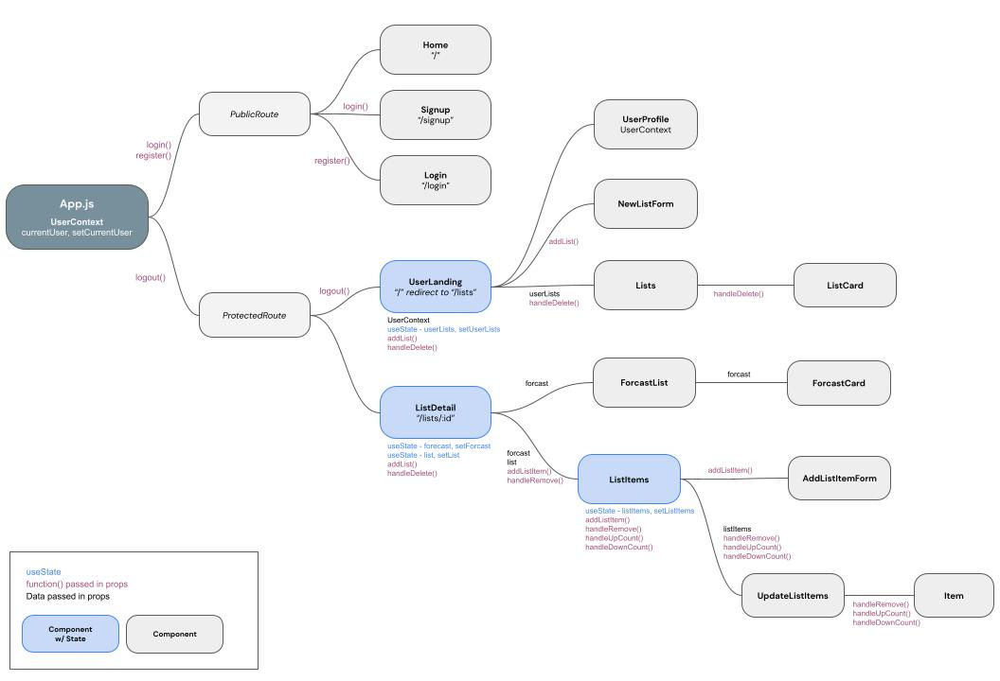

# Capstone Two

## Packable Frontend

When planning for a trip, travelers often struggle to pack for destinations when they aren't familiar with the location's climate. Also most people over-pack for trips, not knowing how many articles of clothing they actually need. The goal of packable is to take the guesswork out of the packing experience. By pulling for a locations past weather data, a user can enter their trip dates and destination, and see likely weather conditions for when they will be there. Further, the app will generate a template packing list based on the number of days the user will be traveling and the climate of their destination. The packing list can then be edited and saved to there user profile. 

------

#### User Flow

------

### PackableApi

The PackableApi class ties together methods the app's frontend uses to get / send requests to the backend API. 

The token used to interact with the API and authenticate each request is stored in the header within this class, and sent to the server with each request.

Individual API routes are stored here for endpoints that the app will use in various API call functions depending on what data the components need. 

------

### Routes

The App's routes are wrapped in one of two wrapper routes that dynamically render components based on whether a user is logged in or not. 

#### `<PublicRoutes/>`

If no user token is found in local sorage or the user token cannot be authenticated / verified, the `Login` homepage will render with the option for the user to navigate to `Signup`. The NavBar at the top of the page will only display links for login in and signup. 

#### `<ProtectedRoutes/>`

If a valid user token is found in local storage, a NavBar showing the option to view user info and all user lists, and logout will render.

##### `/lists`

Once a user is logged in, they are routed to `/lists` which displays their profile information, a form to add a new list, and a section showing a summary of all of their lists. 

From here, the user can select a list to view it's details, delete a list, and create a new list by submitting the form with destination, arrival date and departure date. Once the form is submitted, the server updates and the user is re-routed to the newly created list detail page.

##### `/lists/:id`

If a list is selected, the user is routed to `/lists/:list_id` which renders the List Detail page. A daily forecast based on the list destination and travel dates is generated, followed by a section of auto generated List Items, calculated based on the length of the trip and general climate conditions of the destination during the travel dates.

From here, the user can add new list items, edit quantities of existing list items, and delete list items. 

------

### Custom Hooks

#### `useLocalStorage`

Checks for a matching local item on local storage by key and either removes the item from local storage if key has no asigned value (ie. no token) or sets a key and value to local storage if one isn't there. 

Utilizes useEffect to update local storage if local item or it's key change in state. 

------

### Component Hierarchy

------

### Improvements to be made

Error handling on frontend needs to be set up if a list with selected id is not found. Right now the `LoadingSpinner` spins forever. Should redirect to user's landing page with all lists.

`ListItems` are only stored in state right now. Still need to add functions to connect with API so items can be added, updated to and deleted from database in real time.  

There is no edit option currently to update `UserProfile` or `ListDetail`. Functionality is set up in the backend, but need to implement on frontend.

Once backend is updated - routes will need to include username so only lists belonging to each user can be accessed:

- `/lists` => `/:username/lists`
- `/lists/:list_id` => `/:username/lists/:list_id`

Styles need to be standardized across components - currently a mix of native bootstrap, reactstrap and custom styles.

------

#### Create React App

This project was bootstrapped with [Create React App](https://github.com/facebook/create-react-app). In the project directory, you can run:

#### `npm start`

Runs the app in the development mode.\
Open [http://localhost:3000](http://localhost:3000) to view it in your browser.

The page will reload when you make changes.\
You may also see any lint errors in the console.

#### `npm test`

Launches the test runner in the interactive watch mode.\
See the section about [running tests](https://facebook.github.io/create-react-app/docs/running-tests) for more information.

#### `npm run build`

Builds the app for production to the `build` folder.\
It correctly bundles React in production mode and optimizes the build for the best performance.

The build is minified and the filenames include the hashes.\
Your app is ready to be deployed!

See the section about [deployment](https://facebook.github.io/create-react-app/docs/deployment) for more information.

#### `npm run eject`

**Note: this is a one-way operation. Once you `eject`, you can't go back!**

If you aren't satisfied with the build tool and configuration choices, you can `eject` at any time. This command will remove the single build dependency from your project.

Instead, it will copy all the configuration files and the transitive dependencies (webpack, Babel, ESLint, etc) right into your project so you have full control over them. All of the commands except `eject` will still work, but they will point to the copied scripts so you can tweak them. At this point you're on your own.

You don't have to ever use `eject`. The curated feature set is suitable for small and middle deployments, and you shouldn't feel obligated to use this feature. However we understand that this tool wouldn't be useful if you couldn't customize it when you are ready for it.

https://facebook.github.io/create-react-app/docs/troubleshooting#npm-run-build-fails-to-minify)
